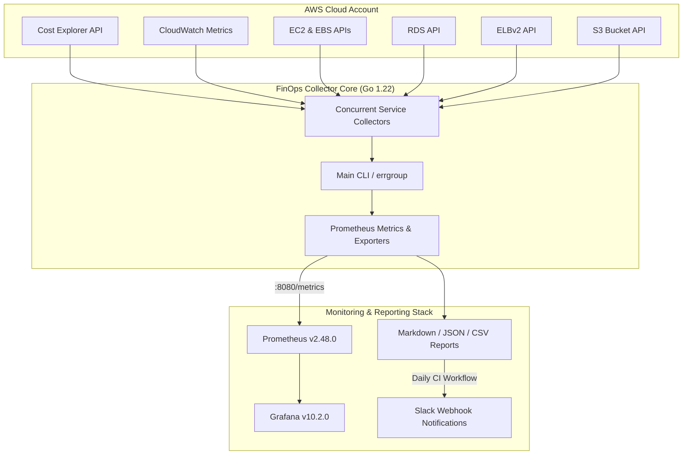

# AWS FinOps & Cost Optimization Dashboard

[](https://github.com/ihkokil/aws-finops-dashboard/actions/workflows/ci.yml)
[](https://github.com/ihkokil/aws-finops-dashboard/actions/workflows/daily-report.yml)
[](https://go.dev/)
[](https://www.terraform.io/)
[](https://grafana.com/)
[](LICENSE)

A production-grade, enterprise-ready **AWS FinOps cost optimization and monitoring tool** written in Go. Continuously audits AWS accounts to detect idle compute, unattached storage, underutilized databases, high NAT Gateway data charges, and Savings Plan utilization gaps — rendering live metrics on 5 pre-configured Grafana dashboards and producing daily executive Markdown reports.

---

## 🏛 Architecture & Component Design



---

## 📁 Repository Structure

```
aws-finops-dashboard/
├── collector/
│   ├── cmd/
│   │   └── collector/
│   │       └── main.go              # Entry point, runs all collectors concurrently
│   ├── internal/
│   │   ├── aws/
│   │   │   ├── cost_explorer.go     # AWS Cost Explorer API client & SP/RI analysis
│   │   │   ├── ec2.go               # EC2 utilization analysis & CW metrics
│   │   │   ├── rds.go               # RDS idle instance & Multi-AZ detection
│   │   │   ├── s3.go                # S3 cost analysis & lifecycle rule gaps
│   │   │   ├── ebs.go               # Unattached EBS volumes & orphaned snapshots
│   │   │   ├── elb.go               # Idle load balancers (ALB/NLB)
│   │   │   ├── nat.go               # NAT Gateway cost & VPC endpoint analysis
│   │   │   └── rightsizing.go       # EC2 rightsizing recommendations
│   │   ├── models/
│   │   │   ├── cost.go              # Shared cost data structs
│   │   │   ├── finding.go           # Finding/recommendation struct & severity
│   │   │   └── report.go            # Full report struct & calculation engine
│   │   ├── output/
│   │   │   ├── json.go              # JSON report exporter
│   │   │   ├── csv.go               # CSV spreadsheet exporter
│   │   │   ├── markdown.go          # Markdown executive summary report
│   │   │   └── prometheus.go        # Prometheus metrics exporter
│   │   └── config/
│   │       └── config.go            # Env & CLI flag configuration
│   ├── Dockerfile
│   └── go.mod
├── terraform/
│   ├── modules/
│   │   ├── iam/                     # Read-only IAM role with explicit DENY rules
│   │   └── scheduler/               # EventBridge cron + ECS Fargate + S3 + Lambda Slack
│   └── environments/
│       ├── dev/
│       └── prod/
├── dashboard/
│   ├── grafana/
│   │   ├── dashboards/
│   │   │   ├── cost-overview.json   # Total spend & executive summary
│   │   │   ├── waste-analysis.json  # Idle & unattached resources
│   │   │   ├── rightsizing.json     # EC2 rightsizing opportunities
│   │   │   ├── trends.json          # 90-day spend trends & forecast
│   │   │   └── savings-tracker.json # Realized vs open savings progress
│   │   └── datasources/
│   │       └── prometheus.yaml
│   ├── prometheus.yml
│   └── docker-compose.yaml          # Local Prometheus + Grafana + Collector stack
├── reports/
│   └── example-report.md           # Realistic sample report output
├── .github/
│   └── workflows/
│       ├── ci.yml                   # Go test, vet, staticcheck, gosec, Docker build
│       ├── daily-report.yml         # Daily scheduled collector run & auto-issue creation
│       └── terraform-plan.yml       # Terraform validation
├── scripts/
│   ├── bootstrap.sh                 # S3 + DynamoDB state backend provisioner
│   ├── run-local.sh                 # Run collector locally with AWS SSO
│   └── setup-grafana.sh             # Auto-provision Grafana dashboards via REST API
├── docs/
│   ├── findings-guide.md            # Severity taxonomy & resource check guide
│   ├── remediation-playbook.md      # AWS CLI remediation commands
│   └── savings-methodology.md       # Savings formulas & 70% realistic calculation
├── .gitignore
└── README.md
```

---

## ⚡ Quick Start (Local Monitoring Stack)

### Prerequisites
- Docker & Docker Compose
- AWS CLI configured (`aws configure` or `aws sso login`)
- Go 1.22+ (if running binary locally)

### 1. Launch Grafana & Prometheus Stack
```bash
cd dashboard
docker-compose up -d
```
Grafana will be accessible at [http://localhost:3000](http://localhost:3000) (Credentials: `admin` / `admin`).

### 2. Run the Collector Locally
```bash
./scripts/run-local.sh default us-east-1
```
Or execute directly using Go:
```bash
cd collector
go run ./cmd/collector/main.go --output-format all --output-dir ../reports/ --days 14
```

---

## 🎛 Collector CLI Flag Reference

| Flag | Default | Description |
|------|---------|-------------|
| `--output-format` | `all` | Output format: `json`, `csv`, `markdown`, `prometheus`, `all` |
| `--output-dir` | `./reports` | Directory where output files are saved |
| `--regions` | `us-east-1` | Comma-separated list of target AWS regions |
| `--days` | `14` | Metric lookback window in days |
| `--serve` | `false` | Run HTTP server exposing `/metrics` for Prometheus scraping |
| `--serve-port` | `8080` | Port for HTTP metrics server |
| `--min-savings` | `5.0` | Minimum monthly savings ($) required to include a finding |
| `--dry-run` | `false` | Scan resources and print summary without writing files |

---

## 🛡 Security & IAM Least Privilege

The Terraform IAM module (`terraform/modules/iam`) creates a read-only role with explicit `Deny` rules on all destructive actions:

```hcl
statement {
  sid    = "ExplicitDenyDestructiveActions"
  effect = "Deny"
  actions = [
    "ec2:TerminateInstances",
    "ec2:DeleteVolume",
    "ec2:DeleteSnapshot",
    "rds:DeleteDBInstance",
    "s3:DeleteObject",
    "s3:DeleteBucket"
  ]
  resources = ["*"]
}
```

The collector **physically cannot mutate or delete** any AWS resource under any circumstance.

---

## 👤 Author

**Md. Iqbal Haider Khan**
- Email: [ihkokil@gmail.com](mailto:ihkokil@gmail.com)
- GitHub: [@ihkokil](https://github.com/ihkokil)
- LinkedIn: [Md. Iqbal Haider Khan](https://www.linkedin.com/in/ihkokil/)


